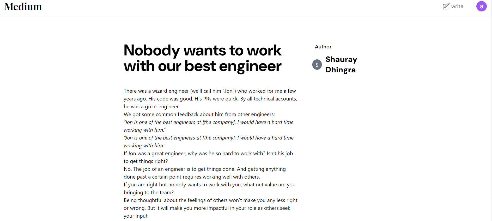

# Medium-Clone-FullStack

## Project Overview

I conceptualized and developed a comprehensive blogging platform inspired by Medium, demonstrating my proficiency in modern web development technologies and architectures. This project showcases my ability to create a seamless user experience while implementing complex backend systems and database management.

## Key Features

### Rich Text Editing
- Implemented a custom rich text editor using Tiptap, allowing users to create and edit articles with formatting options similar to professional publishing platforms.

### Responsive Design
- Utilized React and Tailwind CSS to create a sleek, responsive interface that provides an optimal viewing experience across various devices and screen sizes.

### Serverless Architecture
- Leveraged Cloudflare Workers to build a scalable, serverless backend, significantly reducing operational costs and improving performance.

### Modern Web Framework
- Employed Hono, a lightweight and fast web framework, to efficiently handle routing and API requests within the Cloudflare Workers environment.

### Robust Data Management
- Integrated PostgreSQL as the primary database, ensuring reliable and efficient data storage for user information and blog content.

### ORM Integration
- Utilized Prisma as an Object-Relational Mapping (ORM) tool, streamlining database operations and providing type-safe database access.

### Serverless Database Optimization
- Implemented Prisma Accelerate to enhance database performance in the serverless environment, ensuring quick and efficient data retrieval and manipulation.

### User Authentication
- Developed a secure user authentication system, allowing personalized experiences for readers and writers.

### Article Publishing Workflow
- Created a seamless process for users to draft, edit, and publish articles, including features like auto-save and preview functionality.

## Technical Challenges and Solutions

### Serverless Limitations
- Addressed the stateless nature of serverless functions by implementing efficient caching strategies and optimizing database queries.

### Rich Text Persistence
- Developed a custom solution to store and retrieve formatted text content, ensuring that article formatting is preserved across sessions and devices.

### Performance Optimization
- Implemented lazy loading and code splitting in React to improve initial load times and overall application performance.

### Database Scalability
- Designed the database schema and queries to handle potential high traffic and data growth, ensuring the platform can scale effectively.

## Outcome and Learnings

This project not only resulted in a functional and user-friendly blogging platform but also significantly enhanced my skills in full-stack development. It deepened my understanding of serverless architectures, modern frontend frameworks, and database optimization techniques. The experience of integrating various technologies to create a cohesive application has prepared me for tackling complex web development challenges in future projects.

## Getting Started

### Prerequisites

- Node.js
- PostgreSQL
- Prisma
- Cloudflare account

### Installation

1. Clone the repository:

    ```bash
    git clone https://github.com/your-username/medium-clone.git
    cd medium-clone
    ```

2. Install dependencies:

    ```bash
    npm install
    ```

3. Set up PostgreSQL database and update the Prisma configuration:

    ```bash
    npx prisma migrate dev --name init
    ```

4. Deploy the backend to Cloudflare Workers:

    ```bash
    wrangler publish
    ```

### Running the Application

1. Start the development server:

    ```bash
    npm run dev
    ```

2. Open your browser and navigate to `http://localhost:3000`.

## Screenshots

### Homepage


### BlogPage


### AuthPage


### Editor 


## Contributing

Contributions are welcome! Please fork the repository and create a pull request with your changes.

## License

This project is licensed under the MIT License.


